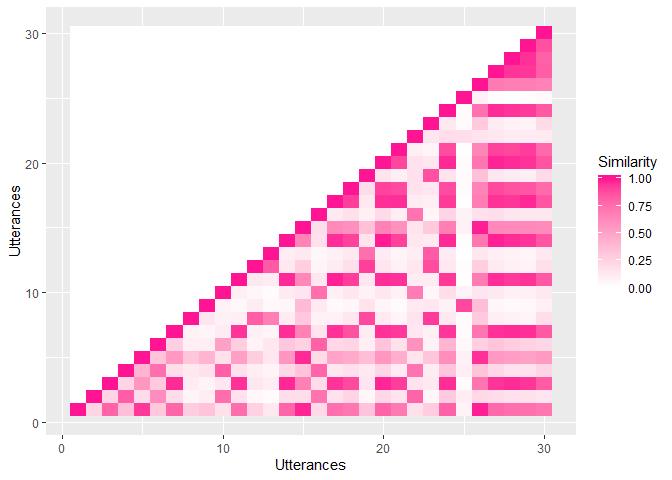

```r
library(qdap)   # for removing stopwords
```

Using the test data (`sample_data.csv`), I want to import, clean, make recurrence plots, and calculate recurrence statistics. 

The basic process goes like this:

1. Import text data file
2. Calculate conceptual recurrence
3. Make recurrence plots
4. Calculate RQA statistics

The last two steps can happen in either order or not at all, depending on what you're looking for. Let's get started.

## Import and clean data

For test purposes, the data is in a CSV file. 


```r
data <- read.csv("sample_data.csv", as.is = TRUE)
str(data)
```

```
## 'data.frame':	30 obs. of  3 variables:
##  $ Type        : chr  "Poll" "Post" "Post" "Post" ...
##  $ Student.Code: chr  "A" "I" "Y" "Z" ...
##  $ Text        : chr  "Cupcake ipsum dolor sit. Amet pastry sugar plum cotton candy chocolate cake chocolate cake brownie cookie. Jell"| __truncated__ "Shaman viral bespoke aesthetic photo booth normcore mustache venmo church-key seitan succulents tumblr, tattooe"| __truncated__ "Sweet roll bonbon croissant danish tootsie roll carrot cake soufflé bear claw. Sweet sugar plum dragée halvah t"| __truncated__ "Lorem ipsum dolor amet hot chicken chartreuse tattooed gochujang master cleanse occupy small batch. Subway tile"| __truncated__ ...
```

### Pull relevant part of transcript

If you want to examine a subset of the records (just student A, just the first 10 lines, whatever), this is a good place to do that subsetting. Here, I'll use the whole file.


## Conceptual recurrence analysis

### Remove stopwords

Stopwords are common and not-of-interest words (the, and, etc.). You can make your own list, but we used the `qdap` library, which gives several options. Here I'm using the first fifty of Fry's 100 Most Commonly Used English Words. I'm also adding back "question" words, since I might be interested in those.


```r
stopwords <- c(qdapDictionaries::Top100Words[1:50],qdapDictionaries::preposition,c("me","my","i'm"))
stopwords <- stopwords[!(stopwords %in% c("if","what","how","which","when","said"))]  # keep question words

rawposts <- data$Text
posts <- rm_stopwords(rawposts, stopwords = stopwords, unlist = FALSE, separate = FALSE)

str(posts)
```

```
##  chr [1:30] "cupcake ipsum dolor sit. amet pastry sugar plum cotton candy chocolate cake chocolate cake brownie cookie. jell"| __truncated__ ...
```


### Make sentence windows and clean text

Following Angus et al. (2012, DOI 10.1109/TVCG.2011.100), we divide the text into three-sentence windows. Those windows will be used to calculate the similarity of terms. 

The first step below splits each post into a vector of sentences by breaking on "!", "?", or "." characters. The next step chunks those sentences into a list of windows of 3 sentences each (you can change this if you want). Finally, `winwords` takes each window and its sentences into a list of character vectors of words, with punctuation and capitalization removed.


```r
source("functions_cleantext.R")

sentences <- makeSentences(posts)
windows <- makeWindows(sentences, 3)  # 3 sentences per window
winwords <- lapply(windows, lineToWords)
Nwind <- length(windows)
```


```
## First sentences:
```

```
## [1] "cupcake ipsum dolor sit"                                                         
## [2] "amet pastry sugar plum cotton candy chocolate cake chocolate cake brownie cookie"
## [3] "jelly jelly macaroon bear claw halvah cake toffee"                               
## [4] "cupcake gummies chupa chups pudding apple pie"                                   
## [5] "jelly beans toffee jelly"                                                        
## [6] "jelly - o oat cake jelly beans lollipop toffee oat cake soufflé cake carrot cake"
```

```
## First window:
```

```
## [1] "cupcake ipsum dolor sit"                                                         
## [2] "amet pastry sugar plum cotton candy chocolate cake chocolate cake brownie cookie"
## [3] "jelly jelly macaroon bear claw halvah cake toffee"
```

```
## Start of first word-separated window:
```

```
## [1] "cupcake" "ipsum"   "dolor"   "sit"     "amet"    "pastry"
```


Look at the most common terms:


```r
topwords <- table(unlist(winwords))[order(table(unlist(winwords)), decreasing = TRUE)]
head(topwords, n = 15)
```

```
## 
##       cake  chocolate      candy       love      jelly       roll 
##         61         37         36         32         28         22 
##      sweet       bear       claw        pie cheesecake        oat 
##         20         18         18         18         15         15 
##    soufflé     toffee    cupcake 
##         15         15         14
```

```r
words <- names(topwords)
```

## Calculate occurrence statistics and conceptual similarity

In Angus et al. (2012), the conceptual similarity of utterances is calculated using three matrices: *V = S x B*. The functions in `functions_conceprecur.R` build *S* and *B*.  

Before calculating conceptual similarity, you need some information about word occurrence: how many times each word appeared in any window, and how many times each pair of terms co-occurred in the same window.

```r
source("functions_conceprecur.R")
# odat is occurrence data: a list holding uniqWords vector, ucount vector, and cocur matrix
odat <- calcOccur(words)

print(rbind(odat$uniqWords[1:10], odat$ucount[1:10]))
```

```
##      [,1]   [,2]        [,3]    [,4]   [,5]    [,6]   [,7]    [,8]  
## [1,] "cake" "chocolate" "candy" "love" "jelly" "roll" "sweet" "bear"
## [2,] "29"   "28"        "23"    "14"   "16"    "14"   "16"    "15"  
##      [,9]   [,10]
## [1,] "claw" "pie"
## [2,] "15"   "16"
```

```r
odat$cocur[1:5,1:10]
```

```
##      [,1] [,2] [,3] [,4] [,5] [,6] [,7] [,8] [,9] [,10]
## [1,]   29   22   18    9   13    9   12   12   12    12
## [2,]   22   28   18   10    9    9   11   11   11    10
## [3,]   18   18   23    4   10    8   11    7    7     9
## [4,]    9   10    4   14    6    6    5    7    7     7
## [5,]   13    9   10    6   16    6    5   10   10     7
```

With the co-occurrence matrix ready, we can calculate the conceptual similarity of each pair of terms, and the Boolean matrix for whether each term appears in a given utterance (*B* in Angus et al. 2012).


```r
S <- calcSim(odat$ucount, odat$cocur, Nwind)
```

```
## [1] "Calculating similarity of 493 words over 62 windows..."
```

```r
B <- calcB(posts, odat$uniqWords)
```

Now, the feature matrix *V*, which holds the concept vector for each utterance, is just matrix multiplication. The dot product of any two columns of *V* is the similarity of utterances *i* and *j*. 


```r
V <- S %*% B    
# Normalize each column in V to be length 1
vnorm <- apply(V, MARGIN = 2, FUN = function(x) x/sqrt(sum(x*x))) 
```

The final step is to use the feature matrix to calculate the degree of conceptual recurrence between each pair of utterances, AKA the recurrence matrix. 


```r
rmat <- recurMat(B, vnorm)
```


## Recurrence plots

Here's one way to make a recurrence plot from the values calculated above. 

**Note:** There's probably a more up-to-date way of doing this that doesn't use the `melt` function, but I'm not feeling ambitious enough to work it out. (For most purposes `tidyr::gather()` has replaced `reshape2::melt()`, but `gather()` doesn't work on matrices and it's likely it never will, see [http://www.milanor.net/blog/reshape-data-r-tidyr-vs-reshape2/].)


```r
library(reshape2)
library(ggplot2)
```

```
## 
## Attaching package: 'ggplot2'
```

```
## The following object is masked from 'package:qdapRegex':
## 
##     %+%
```

```r
p <- ggplot(data = melt(rmat), aes(x = Var1, y = Var2, fill = value)) 
p + geom_tile() + labs(y = "Utterances", x = "Utterances") + 
  scale_fill_gradient2(low = "white", high= "deeppink", name="Similarity")
```

<!-- -->

(Note: This plot has some blockiness because some of my lorem ipsum text has a small vocabulary, relative to real speech.)

## Recurrence Quantification Analysis

Now I'm ready to look at the recurrence quantification analysis stats. 


```r
source("functions_RQA.R")

(recurStats <- calcRQA(rmat))
```

```
## Warning: package 'fields' was built under R version 3.6.1
```

```
## [1] "Number of points in diagonals: 78"
```

```
## $s_thres
## [1] 0.5
## 
## $l_thres
## [1] 2
## 
## $nrec
## [1] 159
## 
## $rec.p
## [1] 36.55172
## 
## $RR.p
## [1] 36.55172
## 
## $DET.p
## [1] 49.0566
## 
## $MEANLINE
## [1] 2.363636
## 
## $MAXLINE
## [1] 5
```

A few notes on `functions_RQA.R`:

1. Recurrence rate (RR): Webber and Zbilut (2005, eqn. 2.8) and the [recurrence plots website](http://www.recurrence-plot.tk/rqa.php) give different formulas for this. The website version calculates RR over the whole matrix, including the diagonal, so it divides by N^2 as the number of possible points. Webber and Zbilut assume a symmetric matrix and ignore the main diagonal, so their denominator is N(N-1)/2. Our form of `rmat` currently matches the Webber and Zbilut expression better (it's symmetric, and only stores the lower triangle), so the calculation in `functions_RQA.R` matches that. 
2. Max diagonal length (MAXLINE): This loop could be combined with the one immediately above it (calculating DET), or eliminated altogether (see comments at the end of MEANLINE block). The loop-calculated version will report the longest diagonal even if none are over the threshold. That might be useful in some cases, so I'm leaving it for now. 

